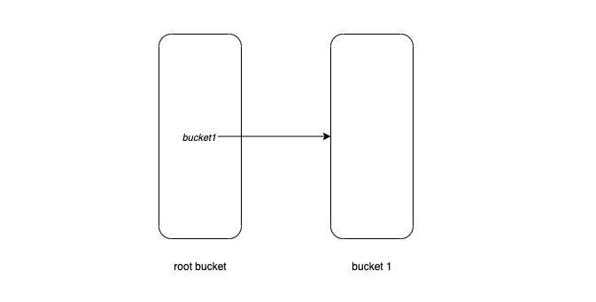
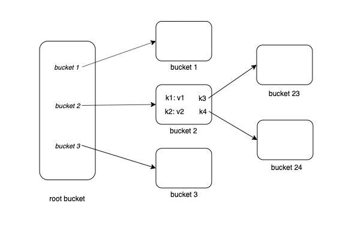
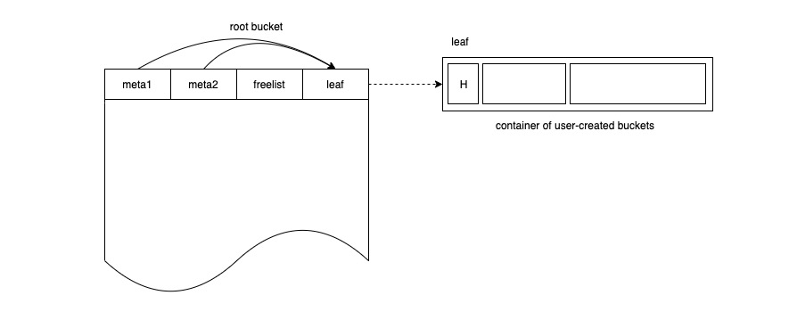
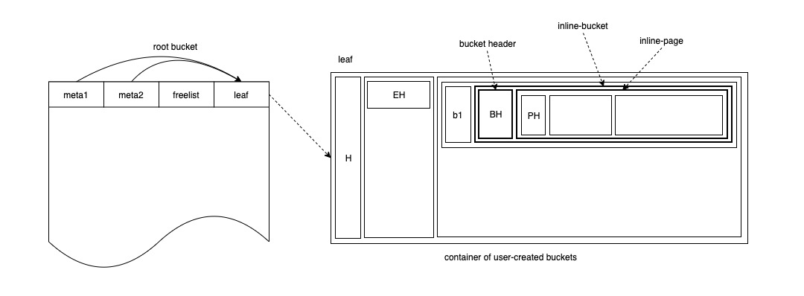

# Bucket

bucket 是 boltDB 中键值对数据的容器，它使得开发者可以在同一个 boltDB 实例下创建不同的容器，存放不同门类的数据；此外，bucket 支持无限嵌套，即容器中可以盛放子容器，方便开发者归类数据的同时，也简化了实现。在本节，我们将讨论：

* Bucket 的逻辑结构
* Bucket 的物理结构
* Cursor

## Bucket 的逻辑结构

由于 bucket 支持无限嵌套，每个 boltDB 实例中只需要保持一个 root bucket 即可，所有开发者新创建的 buckets 都会被保存在 root bucket 中，即逻辑上所有的键值数据都被存储在同一个 bucket 中。

当开发者要创建新的 bucket：

```go
func main() {
  db, _ := bolt.Open("1.db", 0600, nil)
  defer db.Close()
  
  _ = db.Update(func(tx *bolt.Tx) error {
    _, err := tx.CreateBucketIfNotExists("bucket1")
  })
}
```

boltDB 就在 root bucket 上创建了一个新的键值对，键为 bucket1，值为这个 bucket 实例，如下图所示：



继续创建 bucket2, bucket3：


往 bucket2 中插入数据：


在 bucket2 中继续创建 buckets：



## Bucket 的物理结构

在 [B+ 树](./B_PLUS_TREE.md) 一节中介绍到 boltDB 使用 B+ 树存储键值数据及其索引，那么 boltDB 是如何利用 B+ 树实现 bucket 的抽象呢？我们从最简单的情形开始理解：

### 初始化 DB

boltDB 在初始化实例（bolt.Open）时创建 root bucket，在 DB 的[初始化方法](https://github.com/boltdb/bolt/blob/master/db.go#L343)中可以看到：

```go
func (db *DB) init() error {
  buf := make([]byte, db.pageSize*4)
  for i := 0; i < 2; i++ {
		// ...
		// Initialize the meta page.
		m := p.meta()
		// ...
		m.root = bucket{root: 3}
		// ...
  }
  // ...
  // Write an empty leaf page at page 4
  p = db.pageInBuffer(buf[:], pgid(3))
  p.id = pgid(3)
  p.flags = leafPageFlag
  p.count = 0
  // ...
}
```

root bucket 信息被储存在 meta page 中。初始化完毕后，root bucket 指向了一个空的 leaf page，后者将成为所有用户创建的 buckets 的容器，如下图所示：



### 创建一个 bucket

假设用户初始化 boltDB 实例后，创建一个名字叫 b1 的 bucket，反映在图中就是


在 leaf page 中增加一个键值对，其中键为 b1，值为 bucket 实例。bucket 实例的物理结构体为：

```go
type bucket struct {
  root 			pgid   // page id of the bucket's root-level page
  sequence  uint64 // monotonically incrementing, used by NextSequence()
}
```

这里 root 指向该 bucket 的根节点 page id。但如果我们为每个新的 bucket 都分配一个 page，在一些需要大量使用体积较小的 bucket 场景下，显得浪费空间。借用 [nested-bucket](https://github.com/boltdb/bolt#nested-buckets) 的例子：假设我们使用 boltDB 支持一个多租户的应用，系统需要一个 ACCOUNTS bucket 记录每个租户（ACCOUNT）的信息，每个租户内部包含有 Users, Notes 等其它 buckets。在实际使用过程中，根据 8/2 原理，80% 的租户内的 Users，Notes 信息很少，这时候如果为这些 Users、Notes bucket 都分配新的 page，势必会造成数据库磁盘空间浪费，产生内部碎片。

为了解决上述问题，boltDB 使用了 inline-bucket，即不为体积小的 bucket 分配 page，而是为它们各自分配一个虚拟的 inline-page，每个 inline-page 中同样存有 page header，element headers 和 data，再将序列化以后的 inline-page 直接与 bucket 名字储存在一起。事实上，所有新建的 buckets，包括我们刚刚创建的 b1，都是 inline-buckets。boltDB 利用 pgid 从 1 开始的特点，用 pgid = 0 表示 inline-bucket，因此上图细化为：



向 b1 中插入键值对 k1、v1，可以表示为：


### 插入更多的键值数据

当 b1 中的数据达到一定量，即超过 inline-bucket 的大小限制时，inline-bucket 将被转化成正常的 bucket，并能够分配到属于自己的 page，如下图所示：


插入更多的键值数据，bucket b1 就会长成一棵更茂盛的 B+ 树：


### 创建更多的 buckets

假设用户继续创建更多像 b1 一样的 bucket，直到一个 leaf 节点也无法容纳 root bucket 的所有子节点，这时 root bucket 自身也将长成一棵更茂盛的 B+ 树：


## Cursor

cursor 是 bucket 的导游，可以帮助用户顺序或着随机访问 bucket 中的键值数据，它对外提供的方法包括：

```go
// 移动 cursor 到 bucket 中的第一个键值对，并返回键值数据
func (c *Cursor) First() (key []byte, value []byte)
// 移动 cursor 到 bucket 中的最后一个键值对，并返回键值数据
func (c *Cursor) Last() (key []byte, value []byte)
// 移动 cursor 到下一个键值对，并返回键值数据
func (c *Cursor) Next() (key []byte, value []byte)
// 移动 cursor 到上一个键值对，并返回键值数据
func (c *Cursor) Prev() (key []byte, value []byte)
// 移动 cursor 到给定键所在位置，并返回键值数据
func (c *Cursor) Seek(seek []byte) (key []byte, value []byte)
// 删除 cursor 所在位置的键值数据
func (c *Cursor) Delete() error
```

它们可以被分为两类：

* 顺序访问/遍历：First、Last、Next、Prev
* 随机访问/检索：Seek

### 顺序访问/遍历

我们已经知道 boltDB 实例中每个 bucket 的逻辑结构都是 B+ 树，因此遍历 bucket 中数据的过程，就是遍历对应 B+ 树的过程。通常，在树形数据结构上遍历的算法从实现上可以分为递归和迭代两种，前者具有更强的可读性，后者在运行时更节约栈空间，但 B+ 树通常由于单个节点较大，整棵树呈矮胖状，在递归时不会占用过多的栈空间，因此这里无需考虑节约栈空间。但因为 cursor 在使用的过程中，并不会一定会一次性遍历完所有数据，因此 cursor 需要在每次定位之后记录当前位置信息，因此实现上 boltDB 仍然使用了递归的方式。这点也可以从 curso结构体 Cursor 上观察到：

```go
type Cursor struct {
  bucket *Bucket
  stack  []elemRef
}
```

将栈放进结构体中，方便 cursor 记录上一次所在的位置信息。B+ 树的中间节点不直接存储键值数据，因此遍历过程没有前序、中序、后序的区别。bucket 内部可能嵌套其它 buckets，cursor 在返回数据时，如果遇到值是 bucket 的情况，就会将其置为 nil，巧妙地区分两种情况。我们可以通过以下[例子](./bucket/visitkv.go)观察到这点：

```go
// bucket/visitkv.go
func main() {
	// init db
	// ignore errors for simplicity
	_ = db.Update(func(tx *bolt.Tx) error {
		b1, _ := tx.CreateBucketIfNotExists([]byte("b1"))
		_, _ = b1.CreateBucketIfNotExists([]byte("b11"))
		_ = b1.Put([]byte("k1"), []byte("v1"))
		_ = b1.Put([]byte("k2"), []byte("v2"))

		return b1.ForEach(func(k, v []byte) error {
      fmt.Printf("key: %s, val: %s, nil: %v\n", k, v, v == nil)
			return nil
		})
	})
}
```

执行程序：

```sh
$ go run visitkv.go
key: b11, val: , nil: true
key: k1, val: v1, nil: false
key: k2, val: v2, nil: false
```

可以看到，当遇到 b11 bucket 时，返回的值为 nil。

### 随机访问/检索

由于 B+ 树上所有数据都按照键的字节序排列，因此检索的过程与二叉查找树相似。与二叉查找树不同，B+ 树上单个节点通常较大，存放数据较多，因此在每个节点上检索时会使用二分查找来提高检索效率。我们可以估算检索的算法复杂度，如下图所示：


设数据的总数为 N，单个节点能够容纳的键值对数量上限为 C，那么单个节点的查找复杂度为 Clog(C)，树的高度为 log(N)，整个检索过程的时间复杂度为 Clog(C)log(N)。在 CMU 15-445 的 Tree Index 一节中的数据显示，在实践中，一棵 3 层的 B+ 树可以容纳 2,406,104 条数据，而一棵 4 层的 B+ 树可以容纳 312,900,721 条数据，尽管这里的绝对数值没有参考意义（与 page 大小和单个键值数据平均大小有关），我们可以认为通常 B+ 树的高度为常数，因此整个检索的算法复杂度可以近似为 O(1)。

值得一提的是，在实现中，curser 在 seek 时采用递归算法，且都是尾递归，具体可查阅源码。

## 小结

本节介绍 boltDB 中键值数据的容器（bucket）的逻辑结构、物理结构以及如何访问 bucket 中的数据：

* 逻辑上，每个 boltDB 实例保持一个 root bucket，内部盛放所有用户创建的 buckets，用户可以在这些 buckets 中插入普通键值数据或者按需继续嵌套地创建 buckets。这时，整个实例中存储的数据可以被看作是一个 bucket tree；
* 物理上，每个 bucket 实际上是一棵 B+ 树，这些 B+ 树 根据逻辑结构的嵌套关系共同组成一棵巨大的树（不一定是 B+ 树）。
* cursor 提供顺序和随机两种数据访问方式。