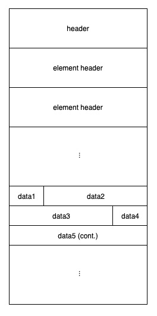
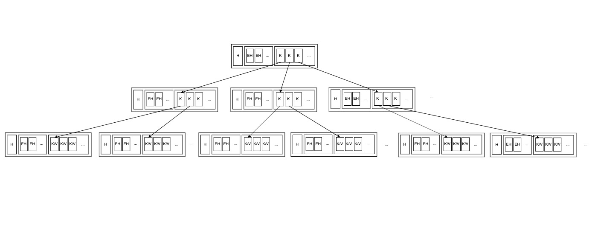
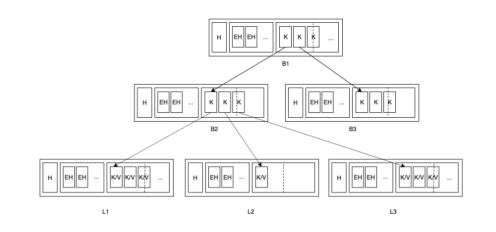
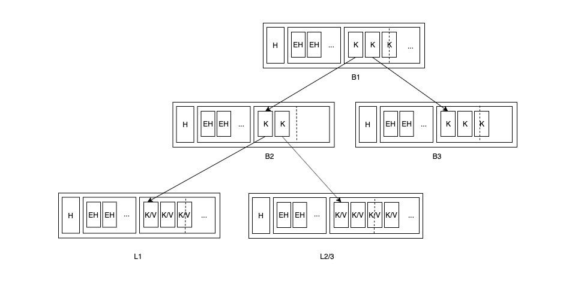
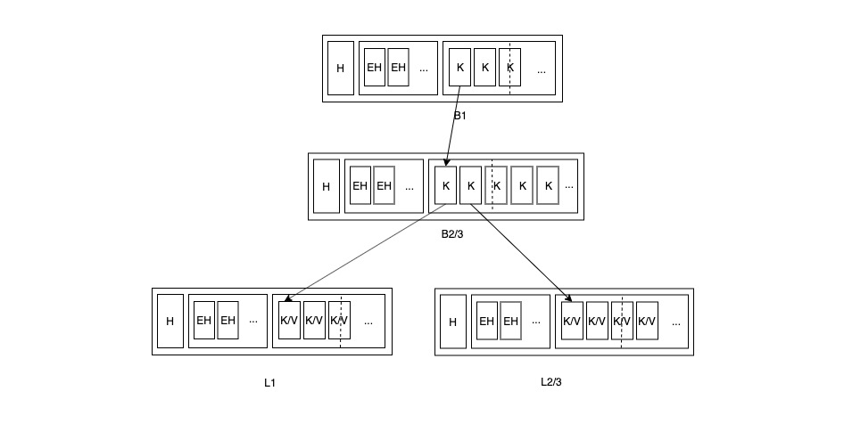
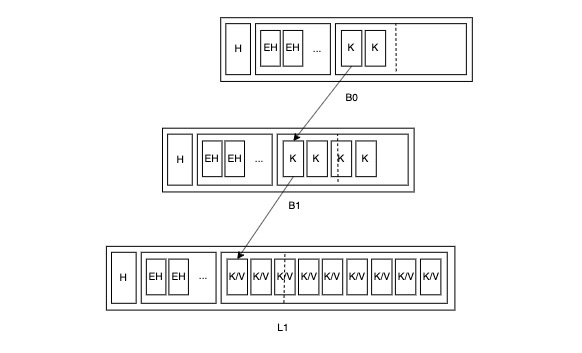
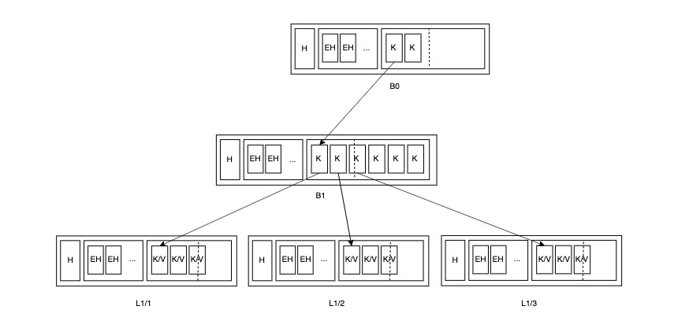
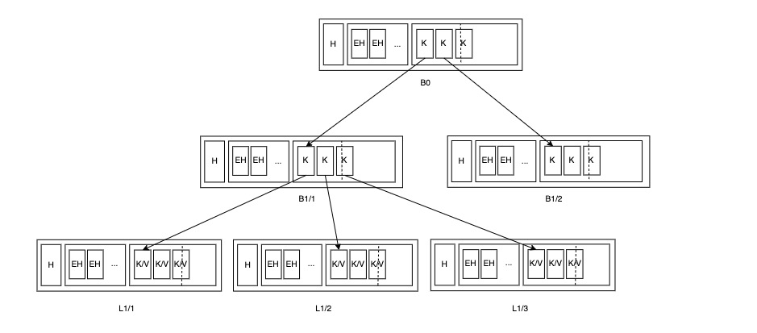

# B+Tree

> boltDB 使用 B+Tree 存储键值数据及其索引。

以数据主要存放的地点来划分，数据库可以分为 in-memory 和 disk-based 两种。前者将所有数据放进内存中，读写的过程不存在磁盘 io；后者将所有数据存放在磁盘中，读写过程需要频繁与磁盘交互，boltDB 就属于后者。对于 disk-based 数据库来说，数据库的性能瓶颈常常出现在磁盘 io 上，因此磁盘 io 次数常常被用来衡量这类数据库各操作的性能，减少磁盘 io 也就成为了数据库设计的重要目标。B+Tree就是优化磁盘 io 的核心数据结构，它可以很好的将数据查询与块存储的特点想结合，最大程度地减少数据读写过程中的磁盘 io。

通常，磁盘中的一个 page 通常对应 B+Tree上的一个 node，数据库从磁盘中载入数据的过程就是将 page 反序列化成 node 的过程，而将数据写入磁盘的过程就是将 node 序列化成 page 的过程。在 [数据存储层](./STORAGE.md) 一节中，我们了解到的 branch page 和 leaf page 对应的正是 boltDB 中 B+Tree上的 branch node 和 leaf node。由于 boltDB 是键值数据库，非关系型数据库，每条数据只有一个字段，因此也只需要在这个字段上建立索引。在其极简的设计理念作用下，boltDB 直接将数据存储在 B+Tree 索引的 leaf node 上。

为了方便，本文将以 node 为中心来讨论 boltDB 中的 B+Tree的结构及相关算法。

## 结构

B+Tree中的每个 node 的结构都由 header, element header 列表及数据列表依次构成，branch node 中存储的数据为键，leaf node 中存储的数据为键值对：

将上图进一步简化，得到 branch node：

leaf node：

利用 branch node 和 leaf node 就能够组建出一棵合法的 B+Tree：

这棵树的特性罗列如下：

* 整棵 B+Tree是完美平衡树，即每个 leaf node 的深度都一样
* 除 root node之外，其它 node 的填充率需要大于 FillPercent，默认为 50%
* 每个 node 存储的数据和元数据总量不能超过一个 page，允许存储变长的键值数据
* 所有的键值对都存储在 leaf node 中，branch node 只存储每个 child node 的最小键（如上图箭头所示），键的大小由键的字节序来决定

## 算法

与常见资料上介绍的 B+Tree操作不同，boltDB 在更新 B+Tree数据时不会直接修改树的结构，只更新数据，在将数据写入磁盘前才按需合并、分裂 node，保持 B+Tree的特性不变；换个角度看，实际上 boltDB 中的 B+Tree是一棵磁盘中的 B+Tree，它的一些不变性质只在落盘后给与保证，而在内存中它的结构可以不符合不变性质的要求。

### 插入/删除键值数据

由于 boltDB 在更新 B+Tree时不会直接修改树的结构，只更新数据，因此，boltDB 在读写事务中插入数据、删除数据只需两步：

* 顺着 root node 找到目标键所在的 leaf node
* 插入/删除键值对数据

#### 插入

插入数据可能造成 node 中的数据超过单个 page 大小：

同时也要考虑单个键值对数据过大的情况：

#### 删除

删除数据可能使得 node 处于不平衡的状态，即键值对删除后 node 中的总数据量少于最低要求（由 FillPercent 决定）：

删除操作本身不执行 merge 操作，但它会在结束前将该 node 标记为 unbalanced，等到数据将要写入磁盘时再统一处理。

### rebalance/spill

在读写事务 commit 时，boltDB 通过两个操作 — rebalance 和 spill 来保证即将写入磁盘的 B+Tree符合上文罗列的不变性质：

* rebalance：将负载不足的 node 与 sibling node 合并
* spill：将超载的 node 分裂成多个较小的 nodes，并序列化到 page 中等待写出

#### rebalance

> rebalance attempts to combine the node with sibling nodes if the node fill size is below a threshold.

执行过删除操作的 leaf node 都会被打上 unbalanced 的记号，而这些记号的消费者正是 rebalance，它负责将填充率不足 FillPercent 的 node 与对应的 sibling node 合并，以下图为例（图中虚线为填充率）：

当 L2 的数据总量不足，rebalance 找到它的 sibling node L3，将二者合并，并更新它们的 parent node B2：

这时，B2 的数据总量也下降到 FillPercent 之下，rebalance 需要递归地继续合并 B2 与 B3：

如果有必要，这样的递归过程将持续到 root node 为止。

这里还有一种特殊情况需要考虑：当 root node 为 branch node，且它只有一个 child node 时，可以直接将唯一的 child node 提拔成 root node，并释放原先的 root node。

rebalance 之后，内存中的 B+Tree 满足：所有 nodes 的数据填充率都大于 FillPercent。但这些 nodes 的填充率可能远远大于 100%，因此就需要 spill 操作从反方向限制 nodes 的填充率。

#### spill

> spill writes the nodes to dirty pages and splits nodes as it goes.

*注：spill 除了将 node 拆分，还会将其序列化成 page，以下讨论不涉及序列化的部分。*

spill 本意是 ”水太满而从容器中溢出“，这里指的就是 node 中负载的数据太多，溢出到多个 page，举例如下：

显然 L1 中填充率过高，spill 需要将它拆分成多个 nodes：

拆分 L1的过程会导致它的 parent node 填充率升高，进而可能引发 parent node 的拆分：

如果有必要，这样的递归会到达 root node 为止。

parent node 超载的原因除了键值对数量过多，也可能是单个数据过大，如达到多个 pages 大小，这是 spill 不会再将 node 拆分，而是保留这些超载的 node：

在序列化时，这种超载的 node 会被转化为多个 overflow page 存储。

## 小结

boltDB 中的 B+Tree 实现与一般教科书上的不同，主要体现在：

* 支持存储变长键值数据
* 数据更新时逻辑极简，允许内存中的数据结构暂时违反 B+Tree 的特性，将特性维持延迟到落盘时才做

## 参考

* [boltdb src code: node.go](https://github.com/boltdb/bolt/blob/master/node.go)
* [Lessons Learned While Implementing a B+Tree](https://hackthology.com/lessons-learned-while-implementing-a-btree.html)

