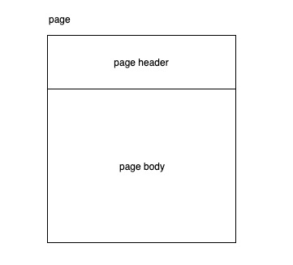
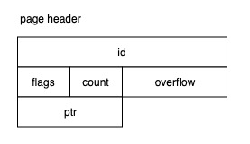
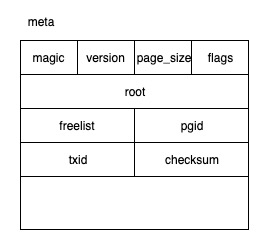
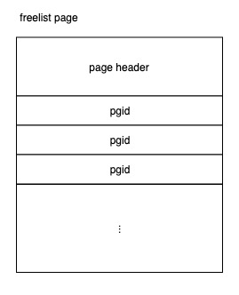
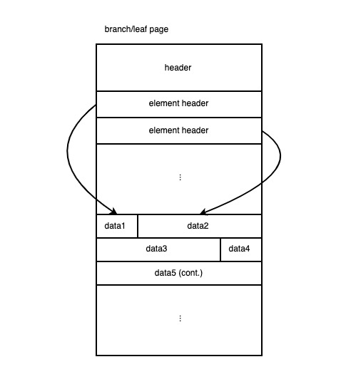
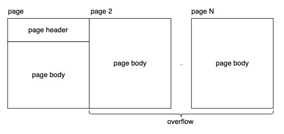
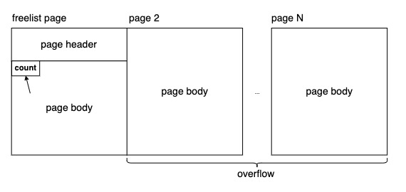
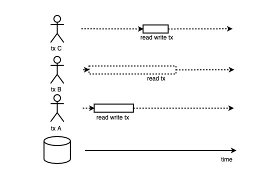

# 存储与缓存

存储层负责管理数据库元数据以及元数据的读写，它主要关心：**元数据、索引、数据在磁盘上的表示**；缓存层负责管理数据库各数据在磁盘与内存之间的移动，它主要关心：**何时将数据读入到内存的何地，何时将数据写出到磁盘的何地**。由于 boltDB 的缓存层处理较简单，因此本文将缓存层与存储层合并讨论。

## 目录

* 存储
  * Page
    * Page 类型与布局
    * 大体积数据的存储
  * Heap File Organization
    * Freelist
* 缓存
  * 读缓存：mmap
  * 写缓存

## 存储

当我们[新建一个 boltDB 实例](./storage_and_cache/open.go)时：

```go
// api/open.go
func main() {
	db, err := bolt.Open("1.db", 0600, nil)
	if err != nil {
		log.Fatal(err)
	}
	defer db.Close()
}
```

当前目录下会新生成一个文件 "1.db"，我们称之为数据库文件，因为该文件包含了这个实例的**所有信息**：**元数据、索引、数据**。

### Page

每个数据库文件被 boltDB 划分成固定大小的块，每块被称为一个 page，每个 page 的大小由文件系统中的 PAGE_SIZE 决定，后者是数据在磁盘与内存中搬运的最小单位，以我的本本为例：

```sh
$ getconf PAGE_SIZE
4096
```

将数据库文件分成同样大小的块，能达到高效利用文件系统的目的。利用 boltDB 提供的命令行工具，可以看到刚刚创建的数据库文件结构：

```sh
$ bolt pages 1.db
ID       TYPE       ITEMS  OVRFLW
======== ========== ====== ======
0        meta       0            
1        meta       0            
2        freelist   0            
3        leaf       0
```

即：一个空的 boltDB 实例由 4 个 page 构成，其中 2 个 mea page、1 个 freelist page 和 1 个 leaf page：


值得注意的是：**id 相邻的 page 在物理存储上同样相邻**。

#### Page 类型与布局

从 [page.go#L17](https://github.com/boltdb/bolt/blob/master/page.go#L17) 可以看到，boltDB 的 page 共有 4 种类型：

```go
const (
	branchPageFlag   = 0x01
	leafPageFlag     = 0x02
	metaPageFlag     = 0x04
	freelistPageFlag = 0x10
)
```

##### 整体布局

不论是哪种 page，它的结构都由 header 和 body 构成：



展开 page header 的结构得到：



| 字段名   | 说明                                                         |
| -------- | ------------------------------------------------------------ |
| id       | page id                                                      |
| flags    | 区分 page 类型的标识                                         |
| count    | 记录 page 中的元素个数                                       |
| overflow | 当遇到体积巨大、单个 page 无法装下的数据时，会溢出到其它 pages，overflow 记录溢出数 |
| ptr      | 指向 page 数据的内存地址，该字段仅在内存中存在               |

##### Meta Page 布局

meta page 是 boltDB 实例元数据所在处，它告诉人们**它是什么**以及**如何理解**整个数据库文件，其结构如下：



| 字段名    | 说明                                                         |
| --------- | ------------------------------------------------------------ |
| magic     | 一个生成好的 32 位随机数，用来确定该文件是一个 boltDB 实例的数据库文件（另一个文件起始位置拥有相同数据的可能性极低） |
| version   | 表明该文件所属的 boltDB 版本，便于日后做兼容与迁移           |
| page_size | 上文提到的 PAGE_SIZE                                         |
| flags     | 保留字段，未使用                                             |
| root      | boltDB 实例的所有**索引及数据**通过一种树形结构组织，而这个树形结构的根节点就是 root |
| freelist  | boltDB 在数据删除过程中可能出现剩余磁盘空间，这些空间会被分块记录在 freelist 中备用 |
| pgid      | 下一个将要分配的 page id (已分配的所有 pages 的最大 id 加 1) |
| txid      | 下一个将要分配的事务 id。事务 id 单调递增，是每个事务发生的逻辑时间，它在实现 boltDB 的并发访问控制中起到重要作用 |
| checksum  | 用于确认 meta page 数据本身的完整性，保证读取的就是上一次正确写入的数据 |

magic, version 和 checksum 一同用于[验证数据库文件的合法性](https://github.com/boltdb/bolt/blob/master/db.go#L982)。

*两份 meta page*

仔细观察 1.db 的布局，你可能会有疑问：**为什么有两份 meta page**？这可以理解为一种本地容错方案：如果一个事务在 meta page 落盘的过程中崩溃，磁盘上的数据就可能处在不正确的状态，导致数据库文件不可用。因此 boltDB 准备了两份 meta page A 和 B，如果上次写入的是 A，这次就写入 B，反之亦然，以此保证发现一份 meta page 失效时，可以立即将数据恢复到另一个 meta page 表示的状态。这里恢复 meta page 很好理解，数据如何恢复到上一个状态？boltDB 的思路很简单，每次数据发生更新，都写入到新的 page 中，数据库文件中总是保留上一次写入的数据，**用空间换取更简单的处理逻辑**。

##### Freelist Page 布局

freelist 中存储着一个有序的 page id 列表：



有序排列的 page id 方便了 freelist 分配策略的实施，具体将在 Heap File Organization 一节中介绍。

##### Branch/Leaf Page 布局

boltDB 利用 B+ 树存储索引和键值数据本身，这里的 branch/leaf 指的就是 B+ 树的分支/叶子节点。由于 branch/leaf 需要存储大小不同键值数据，它们的布局如下图所示：



在 page header 之后，顺序排列着 page 中每个键（值）数据的元信息，称为 element header，每个 element header 记录具体键（值）数据的位置和大小信息。这种布局也被称为 Slotted Pages。

*Branch Page 布局*

branch page 存储 B+ 树的分支节点数据，每个分支节点需要存储若干个键，用来表示子节点所包含键的上下界。它的布局如下图所示：


其中 element header 的布局如下图所示：


| 字段名 | 说明                  |
| ------ | --------------------- |
| pos    | 键的位置，即位移      |
| ksize  | 键的长度              |
| pgid   | 子节点所在 page 的 id |

*Leaf Page 布局*

leaf page 存储 B+ 树的叶子节点数据，即键值对数据，它的布局如下图所示：


其中 element header 的布局如下图所示：


| 字段名 | 说明                   |
| ------ | ---------------------- |
| flags  | 保留字段，同时方便对齐 |
| pos    | 键值的位置，即位移     |
| ksize  | 键的长度               |
| vsize  | 值的长度               |

#### 大体积数据的存储

每个 page 大小有限，当需要存储超过单个 page 大小的数据时，该如何处理？如：

* branch/leaf page 遇到大的键值对数据
* freelist page 中空闲 page 列表较长

boltDB 通过引入 overflow page 来解决这个问题，当需要存储超过单个 page 大小的数据时，就申请满足大小需求的连续 N 个 pages，其中第 2 个到第 N 个是第 1 个 page 的 overflow，它们与第 1 个 page 共用 page header：



这些连续的 pages 在 boltDB 眼里就是一个大体积的 overflow page，方便逻辑上的读写。

在写出 overflow page 时，boltDB 会预先根据 page header，如果是 branch/leaf page 还包括 element headers，计算出整个 page 的大小，若它的大小超过单个 page，则申请连续的多个 pages，并记录 overflow 个数。在读取时，同样将其看作一个逻辑 page 读入，由于 pages 之间连续，直接根据 page header 中的数量，如果是 branch/leaf page 还包括 element headers 中的位移和大小就可以读出相关的所有数据。但有一种情况需要特别考虑：

*超大的 freelist page overflow*

freelist page 中的元素都是 pgid，没有 element header，没有各元素的位移信息，因此可能出现 freelist 的实际长度可能超过 count（uint16） 的上限 65535 的情况，boltDB 采用了比较讨巧的处理方式：

```go
if p.count = 0xFFF {
  // first 8 bytes after page header is considered as the real number
} else {
	// p.count is the number of elements
}
```

当 count 值恰好为上限时，就认为在 page header 之后的第一个 8 字节（uint64），记录 freelist 的实际长度：



### Heap File Organization

数据库从操作系统申请的文件空间一般只增不减，因为实践经验告诉数据库工程师：**一旦数据库的数据存储量超过某个值，即使出现数据删除操作，在不久的将来存储量必将再次超过该值**。boltDB 也不例外，我们可以做一个实验：

1. 利用 [api/generate_1000_users.go](./api/generate_1000_users.go) 往数据库中插入一定规模的数据
2. 利用 [api/delete_buckets.go](./api/delete_buckets.go) 删除这些数据

在步骤 1 后利用 bolt stats 查看数据库文件：

```sh
$ bolt stats 2.db
Page count statistics
        Number of logical branch pages: 1
        Number of physical branch overflow pages: 0
        Number of logical leaf pages: 80
        Number of physical leaf overflow pages: 0
...
$ ls -alh 2.db
-rw-------  1 hezheng  staff   512K Aug 21 13:22 2.db
```

在步骤 2 后再次查看：

```sh
$ bolt stats 2.db
Page count statistics
        Number of logical branch pages: 0
        Number of physical branch overflow pages: 0
        Number of logical leaf pages: 0
        Number of physical leaf overflow pages: 0
...
$ ls -alh 2.db
-rw-------  1 hezheng  staff   512K Aug 21 13:22 2.db
```

可以看出，boltDB 并未将删除后多出的磁盘空间还给文件系统。那么 **boltDB 如何管理多出的磁盘空间呢**？这个问题被称为 File Organization，而 boltDB 使用的方法被称为 Heap File Organization，可以类比程序运行时的 Heap 内存管理。在 boltDB 中负责管理这些磁盘空间的模块叫作 **freelist**。

#### Freelist

freelist 管理空闲 pages 的分配与回收。读写事务申请磁盘空间时，freelist 总是分配找到一段物理上连续的磁盘空间，若能够找到一段连续空间满足所需大小，则直接分配，否则 boltDB 就向操作系统申请新的磁盘空间。

freelist 中保存着顺序排列的空闲 page id，举例如下：


##### 分配策略

由于 freelist 中总是顺序保存当前的空闲 page id，分配策略就是从小到大扫描一次列表，一旦发现连续的 pages 满足需求，就将其从 freelist 中移除，分配给申请空间的事务。

以上图为例，若某读写事务向 freelist 申请 2 个 pages 空间，则 page 5-6 将被分配；若申请 3 个 pages 空间，则 page 15-17 将被分配；若申请 5 个 pages 空间，则 boltDB 会向操作系统申请额外的磁盘空间来分配。

##### 释放策略

当遇到删除数据时，读写事务会将多余的磁盘空间释放回 freelist 中，此时 freelist 不会立即将其分配出去，而是将这些释放的 pages 标记成 pending 状态，直到系统中不存在任何读事务依赖这些 pages 中的旧数据时，才正式将其回收再分配。场景举例如下：



只读事务 B 正在运行，这时读写事务 A 从数据库中删除了一部分数据，并将相应的磁盘空间释放回 freelist 中，若此时 freelist 立即将这些刚释放的 pages 分配给下一个读写事务 B，后者可能对其修改后将其落盘，在这个过程中只读事务 B 仍然在读取数据，就可能读到相同数据的不同版本。而实际上，事务 A 释放磁盘空间时，freelist 仅仅将其标记为 pending 状态，等待类似 B 一样仍然依赖这些 pages 中旧数据的事务执行完毕后再将其回收再利用，从而避免这种问题发生。这种释放策略在实现数据库多版本并发控制（MVCC）中尤为重要，我们将在[事务](./TX.md)一节中继续讨论这个话题。

## 缓存

计算机在内存中读写数据的速度要远远快于在磁盘中读写数据。通过预测数据的读取模式，缓存未来可能再次用到的数据避免重复从磁盘读取，能够提高数据库读效率；写出数据时，合理地将短期内不会再被修改的脏数据批量写出，减少写出频率，能够提高数据库写效率。以上两部分正是缓存层的主要工作。

### 读缓存：mmap

mmap 是操作系统提供的系统调用，它将系统中的某个文件或设备的数据直接映射到一块大小给定的虚拟内存中，这块虚拟内存可以大于或小于该文件或设备的实际所占空间大小。映射完毕后，应用程序可以认为（实际并不会）映射对象的数据已经全部读入内存中，任意访问这块虚拟内存中的数据，操作系统在背后全权负责数据的缓冲读写。

boltDB 利用 mmap 管理数据的读缓冲，即让操作系统来决定何时将数据读入内存，当缓冲区大小不足时如何选择被置换的数据，boltDB 只管像访问字节数组一样访问数据库文件即可。当然，使用 mmap 也失去了数据读取的控制权，无法根据数据库系统的运行逻辑来优化数据预取（prefetching）及缓存置换（buffer replacement）过程。话虽说如此，但实际情况是，boltDB 每次都选择将数据库文件 mmap 到一块不小于数据库文件本身大小的虚拟内存中，因此实际上只有 demand paging，没有 buffer replacement。

以以下的简化代码为例：

```go
func mmap(db *DB, sz int) error {
  b, _ := syscall.Mmap(fd, 0, sz, flags)
  db.data = (*[maxMapSize]byte)(unsafe.Pointer(&b[0]))
}
```

在执行 mmap 函数后，boltDB 实例得到一个内存地址。在 boltDB 实例眼里，以这个地址为起点的一段连续内存空间中映射着数据库文件，它可以随机访问其中的数据：

```go
func (db *DB) page(id pgid) *page {
  pos := id * pgid(db.pageSize)
  return (*page)(unsafe.Pointer(&db.data[pos]))
}
```

### 写缓存

读写事务 commit 时，会将所有脏数据（dirty pages）落盘。在落盘前，boltDB 会将这些 pages 按 page id 升序排列，再依次写出到磁盘中。由于数据库文件中，所有 pages 按 id 升序排列并相互毗邻，因此对于存储设备来说是一次顺序扫描，提高了写效率。

# 参考

* [linux: mmap2](http://man7.org/linux/man-pages/man2/mmap.2.html)

