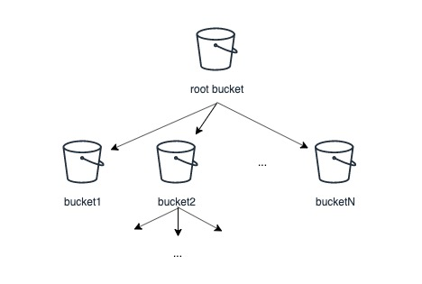
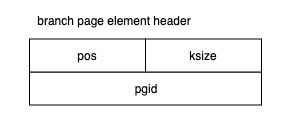
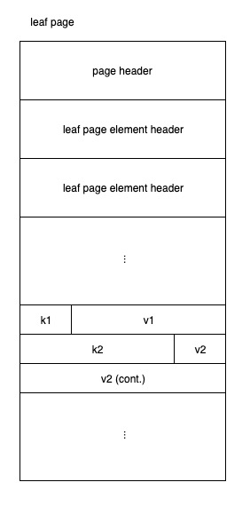
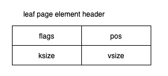
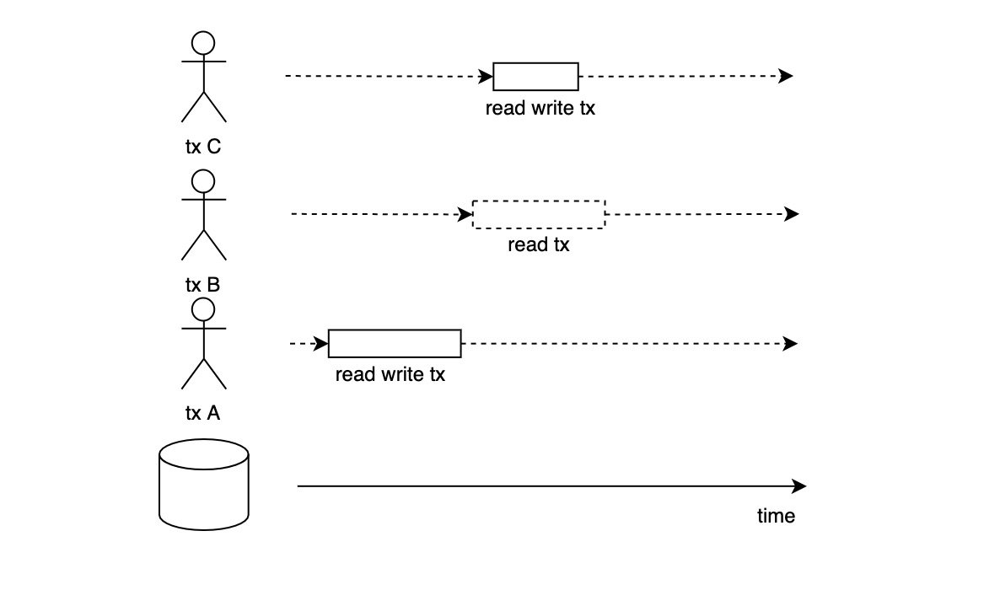

# 数据存储层

## 目录

本节介绍 boltDB 的数据存储层，主要内容包括：

* 数据库文件
  * Page
  * 文件大小变化
  * flock
* freelist

## 数据库文件

boltDB 的数据使用单个本地文件存储，数据库所有的信息，包括存储数据和数据库元数据，都保存在其中。

```go
// api/open.go
func main() {
	db, err := bolt.Open("1.db", 0600, nil)
	if err != nil {
		log.Fatal(err)
	}
	defer db.Close()
}
```

我们在调用 bolt.Open 时传入的 path 正是该文件的路径。

### Page

page 是 boltDB 文件的最小可分的单元，也是数据在物理层读写的最小单元，当我们使用 bolt.Open 初始化一个 boltDB 的实例时，会得到一个名为 "1.db" 的数据库文件，我们可以使用命令行来查看它的结构：

```sh
$ go run api/open.go
$ bolt pages 1.db
ID       TYPE       ITEMS  OVRFLW
======== ========== ====== ======
0        meta       0            
1        meta       0            
2        freelist   0            
3        leaf       0          
```

可以看到， 一个空的 boltDB 实例由 4 个 page 构成，其中 2 个 meta page、1 个 freelist page 和 1 个 leaf page，换一种方式看，就是：


下一个问题很自然的就是：

> page 有几种，每种类型的 page 中都存储什么样的信息？

从[源码](https://github.com/boltdb/bolt/blob/master/page.go#L17)中可以看到，boltDB 的 page 分为 4 种：

```go
const (
	branchPageFlag   = 0x01
	leafPageFlag     = 0x02
	metaPageFlag     = 0x04
	freelistPageFlag = 0x10
)
```

在了解 4 种 page 之前，我们需要了解 page 的共同属性，即 page 元数据，也称为 page header。boltDB 中 page 的结构体如下所示：

```go
type page struct {
  id       pgid      // page id
	flags    uint16    // 即区分 page 类型的 flags
	count    uint16    // 记录 page 中的元素个数
	overflow uint32    // 记录 overflow 的 page 个数
  ptr      uintptr   // 指向 page 的实际地址 (mmap 内存的对应位置)
}
```

换一种方式看，就是：


这里需要注意：当 kv 数据过大，一个 page 放不下时，就会造成数据溢出当前 page，具体溢出多少个 page 与 kv 数据的大小相关，overflow 用来记录的就是实际溢出的 page 数量。

#### Meta Page

meta page 是 boltDB 的入口，它的结构如下图所示：


##### magic&version&checksum

magic、version、checksum 都是常数。magic 用来确定该文件是一个 boltDB 的实例，以免系统误读一个非法文件，继续读写造成不可预料的后果；version 用来标识该文件所属的 boltDB 版本，保证系统以正确的方式理解文件，为不同版本的 boltDB 提供向前、向后兼容的可能；checksum 用来确认 meta page 数据本身的完整性，保证读取的 meta page 是最后一次正确写入的数据。每次系统初始化、读取（包括崩溃后读取）实例时，都需要通过这 3 个字段来验证数据库文件的合法性，如下所示：(源码戳[这里](https://github.com/boltdb/bolt/blob/master/db.go#L982))

```go
func (m *meta) validate() error {
  if m.magic != magic {
    return ErrInvalid
  } else if m.version != version {
    return ErrVersionMismatch
  } else if m.checksum != 0 && m.checksum != m.sum64() {
    return ErrCheckSum
  }
  return nil
}
```

##### page_size

上文提到，page 是 boltDB 物理读写的最小单元，那么一个 page 的大小，即 page_size 如何决定？对于 boltDB 来说，既然已经将文件的控制权交给操作系统，page_size 的最佳选择就应该是操作系统的物理读写最小单元，后者可以通过以下方式得到：

```go
db.pageSize = os.Getpagesize()
```

在我的 macbook 2015 上，page 大小为 4096，即 4KB；在 [go playground](https://play.golang.org/p/mXP6qMYcah7) 机器上，page 大小为 65536，即 64KB。

##### root

boltDB 是纯 kv 存储，它包含以下特点：

* 所有的数据都以 kv 形式存在
* 一组 kv 的集合称为 bucket
* kv 中的值可以嵌套 bucket

利用 bucket 嵌套的特点，boltDB 初始化后会建立一个 root bucket，用来盛放新创建的 buckets，如下图所示：



meta 中的 root 就是 root bucket。

##### freelist

freelist 的全名是 free page list，是一个可以被自由分配的 page 列表。freelist 的具体工作模式在后续的文章中会详细介绍，meta 中的 freelist 是 freelist page 的 id，即表明第几个 page 是 freelist page。

##### 其它

* pgid：下一个未分配的 page id
* txid：下一个未分配的事务 id
* flags：保留字段，暂未使用

##### 两份 meta pages

仔细观察图 1 会发现刚初始化的 boltDB 文件上有**两个** meta pages！这是为什么？这其实可以理解为一种本地容错方案：如果一个事务在写 meta page 的过程中崩溃，meta page 中的数据就可能处在不正确的状态，进而造成数据库文件不可用。因此作者为每个文件准备两份 meta pages，每次读取数据库文件时（准确地说是 [mmap 数据库文件时](https://github.com/boltdb/bolt/blob/master/db.go#L282)），选择读取 txid 最大、数据合法的 meta page：

```go
func (db *DB) mmap(minsz int) error {
  // ...
  db.meta0 = db.page(0).meta()
  db.meta1 = db.page(1).meta()
  
  err0 := db.meta0.validate()
  err1 := db.meta1.validate()
  if err0 != nil && err1 != nil {
    return err0
  }
  return nil
}
```

每次 [commit 事务时](https://github.com/boltdb/bolt/blob/master/db.go#L1000)，根据 txid 来轮流写出到 page 0 或 page 1 上：

```go
func (m *meta) write(p *page) {
  // ...
  p.id = pgid(m.txid % 2)
	// ...
}
```

#### FreeList Page

freelist 中存储的内容很简单，就是一个 page id 列表，如下图所示：


但一个 page 只有 4K，最多只能存放 1K 个 page id，显然可分配空间只有 4MB 肯定不够，如何解决这个问题呢？boltDB 的做法很有意思，它利用了 page header 中的 count 字段，若 count 取值为 uint16 的最大值 (0xFFFF)，则认为该 freelist page 还有 overflow page，并以 page header 之后的第一个 uint64 数值表示 freelist 的总长度。在 boltDB 中，这些 freelist pages 会被连续地存储在一起，因此可以通过起点和总长度一次性读写。

#### Branch/Leaf Page

boltDB 使用 B+ 树存储索引和 kv 数据本身，这里的 branch 和 leaf 指的就是树的分支节点和叶子节点：

* branch page：存储分支节点数据的 page
* leaf page：存储叶子节点数据的 page

##### Branch Page

branch page 是中间节点，每个 B+ 树中间节点需要存储若干键值 (k/v 中的 k)，用来表示子节点键值的上界与下界；同时，由于键的大小不一，branch page 的存储结构还需要包容不同大小的键。综合考虑，boltDB 中 branch page 的结构如下图所示：


将 page element header 顺序排列在 page header 之后，然后依次放置变长的键。其中 page element header 的结构如下图所示：



pos 记录键的位置，ksize 记录键的长度，pgid 记录子节点所在的 page id。

##### Leaf Page

leaf page 是叶子节点，每个 B+ 树的叶子节点需要存储实际的 kv 数据；同样的，由于键和值的大小都不固定，leaf page 的存储结构也需要包容变长的键值对。综合考虑，boltDB 中的 leaf page 最终如下图所示：



与 branch page 类似，leaf page 将 page element header 列表顺序排列在 page header 之后，然后依次放置变长的键值对。其中 page element header 的结构如下图所示：



pos 记录键的位置，ksize 与 vsize 分别记录键值的长度，flags 作为保留字段，同时方便对齐。

### 文件大小变化

#### 只增不减

通常数据库文件大小只增不减，避免没必要的释放操作。我们可以利用 api/batch_create.go 往数据库中插入一定规模的数据，再利用 api/delete_bucket.go 删除这些数据，最后利用 bolt 命令行工具查看 pages 信息：

```sh
$ bolt pages 2.db
ID       TYPE       ITEMS  OVRFLW
======== ========== ====== ======
0        meta       0            
1        meta       0            
2        leaf       0            
3        freelist   85      
4        free                    
5        free                    
...
88       free    
```

pages 数量在数据删除后并未减少，我们也可以通过直接查看 "2.db" 文件大小直接观察到这点。

#### 按块增加

meta page 上的 pgid 字段有两个含义：

* 下一个分配的 page id
* 当前已有的 page 总数

在 boltDB 运行过程中，一旦发现所需的 page 总数大于当前 meta page 中记录的 page 总数时，boltDB 就会向操作系统申请更大的空间，申请过程的[代码](https://github.com/boltdb/bolt/blob/master/db.go#L859)如下：

```go
// data unit: byte

const DefaultAllocSize = 1024 * 1024 * 16 // 16MB

func (db *DB) grow(sz int) error {
  if sz <= db.filesz {
    return nil
  }
  
  if db.datasz < db.AllocSize {
    sz = db.datasz
  } else {
    sz += db.AllocSize
  }
  
  // Truncate and fsync to ensure file size metadata is flushed
  // ...
  
  db.filesz = sz
  return nil
}
```

可以看出，当 boltDB 发现数据库文件大小不足时，会根据所需大小来增长数据库文件：

* 若所需大小小于 16MB，则只分配所需大小
* 若所需大小大于 16MB，则每次多分配 16 MB，即以 16MB 为一块，分块增加

### flock

boltDB 通过只允许一个线程执行读写事务 (read-write transaction)，保证可序列化事务隔离。那如果用户在不同进程中两次 Open boltDB 怎么办？解法就是利用 **flock**。boltDB 每次打开数据库文件后，会立即执行 flock：

```go
func flock(db *DB, mode os.FileMode, exclusive bool, timeout time.Duration) error {
	// ...
  flag := syscall.LOCK_SH
  if exclusive {
    flag = syscall.LOCK_EX
  }

  err := syscall.Flock(int(db.file.Fd()), flag|syscall.LOCK_NB)
  if err == nil {
    return nil
  } else if err != syscall.EWOULDBLOCK {
    return err
  }
  // ...
}
```

若用户选择指定只读模式打开 boltDB 实例，即：

```go
db, err := bolt.Open("1.db", 0600, &bolt.Options{ReadOnly: true})
```

那么 flock 会获取 "1.db" 文件的共享锁，若用户未选择或以非只读模式打开，flock 将获取 "1.db" 文件的互斥锁。如此一来，单台机器上就不可能有两个或多个 boltDB 实例能以非只读模式打开数据库文件，从而使得该机器上最多只能有一个线程执行读写事务。

# freelist

boltDB 主要利用 freelist 分配、回收事务所使用的存储空间，当 freelist 中的可分配存储空间不足时，boltDB 会向操作系统申请新的存储空间。因此，了解 freelist 的工作原理对了解 boltDB 的存储管理十分重要。

### 为什么需要 freelist

刚开始接触 freelist，我就有疑问：**“为什么不直接从操作系统申请存储空间，用完了再释放还给操作系统？“** 

主要原因如下：

1. 直接从操作系统申请、释放空间有开销，操作频繁会导致开销变大。
2. 数据库在实践中，占用存储空间整体上呈现递增趋势，只在部分时候出现减少，因此释放还给操作系统的存储空间常常在不久以后需要再次申请，这样还不如不释放，由数据库管理。

为了管理 boltDB 已经申请，但暂时不用的存储空间，就需要 freelist。由于数据库磁盘读写的最小单位就是 page，因此 freelist 实际就是 free page list，即可分配的 page 列表。

我们来看一个示例，首先向一个空的 boltDB 实例中插入 10,000 条 user 数据：

```go
// learn-bolt/memory_management/insert_10000_users.go
func main() {
  db, _ := bolt.Open("mm1.db", 0600, nil)
  defer db.Close()
  
  store := lib.NewStore(db)
  _ = store.CleanupBuckets()
  _ = store.EnsureBuckets()
  
  n := 10000
  _ = store.GenerateFakeUserDataConcurrently(n, 16)
}
```

利用 bolt 的 stats 命令

```sh
$ bolt stats mm1.db
Aggregate statistics for 2 buckets

Page count statistics
        Number of logical branch pages: 10
        Number of physical branch overflow pages: 0
        Number of logical leaf pages: 823
        Number of physical leaf overflow pages: 0
Tree statistics
        Number of keys/value pairs: 10000
        ...
Page size utilization
        ...
Bucket statistics
        ...
```

结合 bolt 的 pages 命令

```sh
$ bolt pages mm1.db
ID       TYPE       ITEMS  OVRFLW
======== ========== ====== ======
0        meta       0            
1        meta       0            
2        leaf       13
...
831      leaf       12           
832      free                    
833      leaf       18           
834      free                    
835      branch     151          
836      branch     9            
837      free                    
838      leaf       2            
839      free                    
840      free                    
841      freelist   5   
```

可以观察到，此时该 boltDB 实例共存储键值对 10,000 个，共从操作系统申请了 841 个 page，其中：

- 2 个 meta page，用于存储数据库元信息
- 833 个 leaf/branch page，用于存储键值数据及索引
- 1 个 freelist page，用于存储事务释放的待分配的 page id
- 5 个 free page，未使用，待分配

接着我们从中删除 3,000 条数据：

```go
// learn-bolt/memory_management/delete_3000_users.go
func main() {
	db, _ := bolt.Open("mm1.db", 0600, nil)
	defer db.Close()

	store := lib.NewStore(db)

	for i := 5000; i < 8000; i++ {
		if err := store.Users.DeleteUserByID(uint64(i)); err != nil {
			log.Fatal(err)
		}
	}
}
```

同样利用 stats 和 pages 命令可以看到，此时该 boltDB 实例共存储键值对 7000 个，共从操作系统申请了 841 个 page，其中：

- 2 个 meta page，用于存储数据库元信息
- 582 个 leaf/branch page，用于存储键值数据及索引
- 1 个 freelist page，用于存储事务释放的待分配的 page id
- 256 个 free page，未使用，待分配

可以看出，删除 3,000 条键值数据后，boltDB 实例占用存储空间未发生变化，未使用的 page 被标记为 free 类型，其 id 被存储在 freelist page 中。

### freelist 结构体

freelist 的结构体如下所示：

```go
type freelist struct {
  ids			[]pgid
  pending map[txid][]pgid
  cache   map[pgid]bool
}
```

其中：

- ids: 所有可分配的 page id 列表，且列表中的 page id 从 1 开始升序排列
- pending: 记录正在进行或已经结束的读写事务即将释放的 page id 列表
- cache: 记录某 page 是否可分配或即将释放的快查表

**为什么 page 还需要一个待释放状态？**为了支持 MVCC（Multiversion Concurrency Control）。举例如下图所示：



当读写事务 A 执行完毕后，读事务 B 开始执行，若紧接着读写事务 C 开始执行，C 就可能修改 B 想要读取的数据，而 B 实际上只想读取 A 执行完毕之后、C 开始执行完毕之前的数据，因此这时候 boltDB 不应该将 A 获取的存储空间释放到 freelist 中允许被分配，而将它置于即将释放的状态，等待 B 执行完毕后再彻底释放，否则如果 C 修改了相关数据，B 就可能读到 C 执行完毕后的数据，这不符合 MVCC 的语义。

### freelist 的分配策略

freelist 向下游提供 allocate 方法用于分配闲置的数据：

```go
func (f *freelist) allocate(n int) pgid
```

设计上，boltDB 使用极简的处理方式。首先 freelist 中的 page id 在任何时候都会被升序排列。每次分配时，顺序遍历 freelist，尝试从中找到一段连续的 n 个 page，成功则将这n 个 page 返回给下游，并将其从 freelist 中去除。由于这些 page 是连续的，allocate 函数只需要告诉下游 n 个 page 的第一个即可。

# 参考


