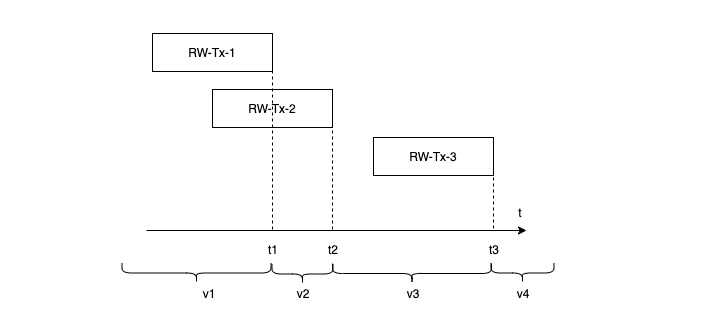
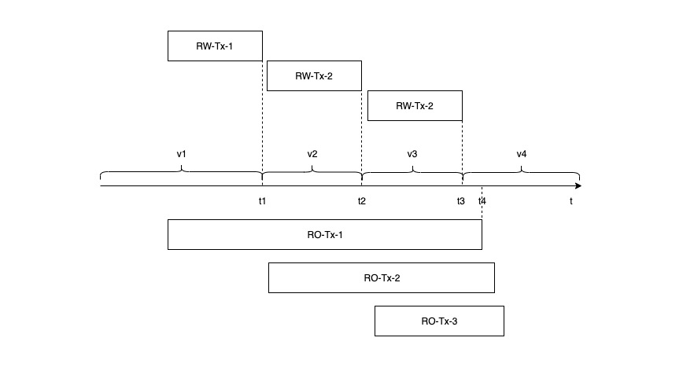

# 事务

事务是数据库提供给应用程序的一层抽象，这层抽象将所有并发控制、软硬件各种异常信息隐藏，只对应用暴露出两种状态：成功(commit)和终止(abort)。读写事务中的数据修改要么执行完成、要么回滚到修改前的状态，不存在执行到一半的中间态。有了事务支持，应用遇到执行失败时仅需按需重试。

Bolt 为用户提供**可序列化(serializable)的、满足 ACID** 的事务支持。

## 并发控制

Bolt 只允许单个读写事务同时执行。但是在使用过程中，不同进程可以访问相同的数据库文件，单个进程也可以同时开启多个事务，因此 Bolt 既需要在数据库文件层面，也需要在单个数据库实例层面完成相应的并发控控制。

### 数据库文件: flock

flock 是操作系统提供的基于某个文件描述符的锁，支持共享和互斥两种模式。由于每个 Bolt 实例各自对应一个独立的文件，flock 就自然而然地成为数据库文件层面并发控制的首选。 

以下是相应的加锁逻辑：

```go
func flock(db *DB, mode os.FileMode, exclusive bool, timeout time.Duration) error {
	// ...
  flag := syscall.LOCK_SH  // 共享
  if exclusive {
    flag = syscall.LOCK_EX // 互斥
  }

  err := syscall.Flock(int(db.file.Fd()), flag|syscall.LOCK_NB)
  // ...
}
```

若用户选择只读模式打开 Bolt 实例，

```go
db, err := bolt.Open("1.db", 0600, &bolt.Options{ReadOnly: true})
```

Bolt 实例会获取`1.db`的共享锁，若用户以非只读模式打开，则将获取`1.db`的互斥锁。这样就不可能有超过一个进程以非只读模式打开数据库文件，从而实现文件级别的并发控制。

### 数据库实例: DB.rwlock

每个 Bolt 实例都有一个 rwlock，用于保证同时在执行的读写事务数量最多只有一个，相应的逻辑在每个读写事务 Begin 的子逻辑 `DB.beginRWTx` 中：

```go
func (db *DB) beginRWTx() (*Tx, error) {
	// ...

	// Obtain writer lock. This is released by the transaction when it closes.
	// This enforces only one writer transaction at a time.
	db.rwlock.Lock()
    
    // ...
}
```

### 瓶颈和场景

Bolt 这种粗粒度的并发控制意味着，即便不同事务读写的数据互不相关，只要有事务在读取整个数据库文件上的任意数据，其它事务就不能往数据库里写数据。因此使用 Bolt 时，每个读写事务的执行时间不宜太长，数据量不宜过大。如果遇到一些吞吐大的写场景，就要求数据库能够支持更细粒度的并发控制，比如支持在命名空间级别、键级别上加锁，用 Bolt 也许不是最佳选择。

## 执行过程

Bolt 支持的事务，按是否修改数据来划分，有只读事务和读写事务；按谁来管理事务生命周期，有隐式事务和显示事务。在隐式事务中，Bolt 负责管理事务的生命周期，如初始化、执行、关闭、回滚事务；在显式事务中，用户需要自行管理相关资源的申请和回收。一个典型的显式事务执行过程如下：

```go
func Explicit(db *DB, fn func(*Tx) error) error {
  t := db.Begin(true)
  // ...
  err := fn(t) // 数据存取逻辑
  if err != nil {
    t.Rollback()
    return err
  }
  return t.Commit()
}
```

在隐式事务中，用户只需要关心数据存取逻辑 `fn` 即可。

## ACID

* 原子性(A): 单个读写事务要么执行成功，要么回滚；
* 一致性(C): 只要程序正确合理地使用事务操纵数据，Bolt 保证原子性和可序列化隔离级别，就能保证一致；
* 隔离性(I): Bolt 只允许一个读写事务同时执行，所有读写事务只能顺序执行，满足可序列化数据隔离级别；
* 持久性(D)：每次读写事务执行`t.Commit()`提交时，就会将脏数据写入磁盘(手动开启`NoSync`除外)，如果落盘失败则回滚。因此事务执行返回且无错误发生时，数据即已持久化。

### MVCC(Multi-version concurrency control)

一般数据库中如果有多个事务并发执行，就可能出现多版本数据。如果处理不好「修改的数据什么时候对哪些事务可见」的问题，就会出现数据不一致，可以看出它与 ACID 中的 I 和 C 息息相关。数据库用户通常会认为库里的数据是「单调突变」的，这种「单调突变」用计算机语言来描述，就是：**数据库状态以读写事务为单位，顺序地、原子地修改数据**。



以上图为例：数据库里的数据在不同时刻应该满足：

| 时刻 | 满足条件 |
|-----|---------|
| t < t1 | 未发生任何变化，记为 v1 版本 |
| t1 <= t < t2 | RW-Tx-1 完成后落盘的数据，记为 v2 版本 |
| t2 <= t < t3 | RW-Tx-1 和 RW-Tx-2 完成后落盘的数据，记为 v3 版本 |
| t >= t3 | RW-Tx-1、RW-Tx-2 和 RW-Tx-3 完成后落盘的数据，记为 v4 版本 |

如果只读事务从开始到结束都落在单个区间内，它能看到的数据应为对应区间内数据所属的版本。但如果只读事务跨越 t1、t2、t3 的边界怎么办？如只读事务 A 在 t1 之前开始，t3 之后结束，那么它应该读取到哪些数据？v1、v2、v3、v4 都有可能，如果是 v2 或 v3 会让用户感到疑惑，不能肯定自己每次能读到的数据版本。比较合理的做法应该是 t1 之前的数据或 t3 之后的数据，即 v1 或 v4。但如果取 v4，为了保证只读事务读取的数据是一致的，该只读事务将被阻塞直到 t3 之后才被执行从而给数据库带来负担。因此，通常事务 A 在结束前读到的数据都应该是 v1 版本的数据。

在多事务并发执行的场景下，要做一款合格的数据库，需要保存数据的多个版本，这就是 MVCC。在数据库中存储单个数据的多个版本，可以**让只读事务不阻塞读写事务的进行、读写事务也不阻塞只读事务的进行**，只读事务只会读取到该事务启动时已经提交的所有读写事务的所有数据，在只读事务启动后写入的数据不会被只读事务访问到。

Bolt 最多只允许一个读写事务同时进行，因此它支持 MVCC 时不需要考虑多个读写事务同时进行的场景。只允许一个读写事务同时进行是否意味着 Bolt 只需要同时保存最多 2 个版本的数据？看个例子：



横轴上方是读写事务，下方是只读事务。在 t3 到 t4 之间，只读事务 RO-Tx-1 要求 v1 版本数据还保存在数据库中；RO-Tx-2 要求 v2 版本数据还保存在数据库中；RO-Tx-3 要求 v3 版本数据还保存在数据库中。因此即使只允许一个读写事务同时进行，数据库仍然需要保存多版本的数据。

我们在[存储与缓存](./STORAGE_AND_CACHE.md)中介绍过，Bolt 将数据库文件分成大小相等的 page 来存储元数据和数据，如下图所示：


如果每个 page 都带有版本，每当 page 中的数据将被读写事务修改时，就先复制数据到新申请的 page 中，然后修改相应的数据，旧版本的 page 直到没有只读事务依赖它时才被回收。使用这种方案使得 MVCC 的实现无需考虑新旧版本共存于同一个 page 的情况，用空间换取了设计复杂度的降低，符合 Bolt 的设计理念。下面罗列一些值得关注的细节：

*meta page*

meta page 存储数据库的元信息，包括 root bucket 等。在读写事务执行过程中，可能在增删改键值数据的过程中修改 root bucket，引起 meta page 的变化。因此在初始化事务时，每个事务都需要复制一份独立 meta，以防止读写事务的执行影响到只读事务。

*freelist page*

freelist 负责记录整个实例的可分配 page 信息，在读写事务执行过程中，会从 freelist 中申请新的 pages，也会释放 pages 到 freelist 中，引起 freelist page 的变化。由于 Bolt 只允许一个读写事务同时进行，且只有读写事务需要访问 freelist page，因此 freelist page 全局只存一份即可，无需复制。

*mmap*

在数据存储层一节中介绍过，Bolt 将数据的读缓存托管给 mmap。每个只读事务在启动时需要获取 mmap 的读锁，保证所读取数据的正确性；当读写事务申请新 pages 时，可能出现当前 mmap 的空间不足，需要重新 mmap 的情况，这时读写事务要获取 mmap 的写锁，就需要等待所有只读事务执行完毕后才能继续。因此 Bolt 也建议用户，如果可能出现执行时间较长的只读事务，务必将 mmap 的初始大小调高一些。

*版本号*

每当 Bolt 执行新的读写事务，就有可能产生新版本的数据，因此只要读写事务的 id 是单调递增的，就可以利用事务 id 作为数据的版本号。

## 参考

* Designing Data-Intensive Applications - Transactions
* [linux: flock](http://man7.org/linux/man-pages/man2/flock.2.html)


